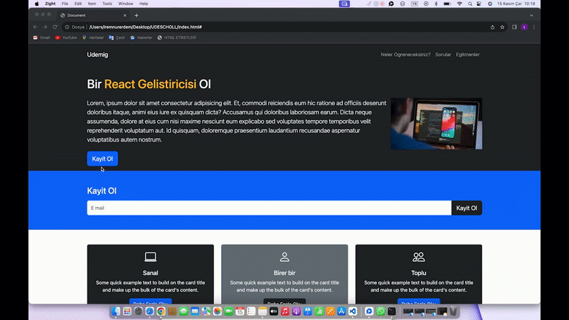

<h1>UDESCHOLL </h1>

<h2>Languages and libraries I use </h2>

"I have created my first project using the Bootstrap library, and I have added a map feature using JavaScript's map function."

<h2>ScreenShot</h2>

